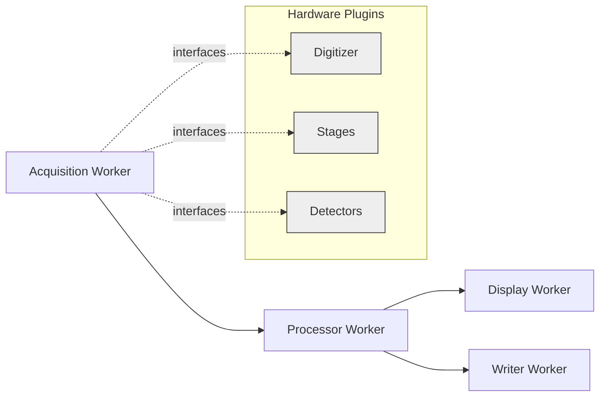

# Architecture

High-level overview of Dirigo's architecture: core abstractions (ABC), Workers, pipelines,
and plugin discovery via entry points. Expand with diagrams as the design stabilizes.

```mermaid
flowchart LR
  A[Acquisition Worker] --> B[Processor Worker]
  B --> C[Display Worker]
  B --> D[Writer Worker]
  subgraph Hardware Plugins
    H1[Digitizer]:::hw
    H2[Stages]:::hw
    H3[Detectors]:::hw
  end
  A -. interfaces .-> H1
  A -. interfaces .-> H2
  A -. interfaces .-> H3
  classDef hw fill:#eee,stroke:#333,stroke-width:1px;
```
